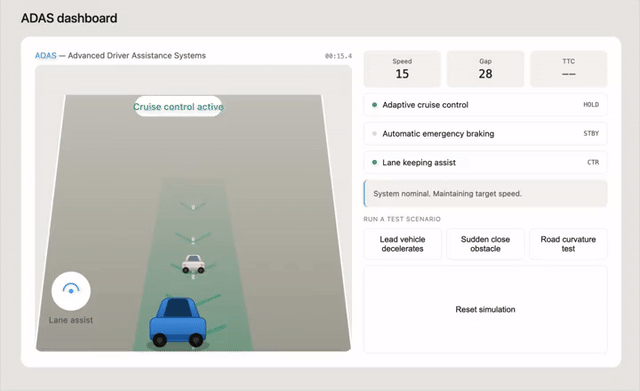

# ADAS Simulation Pipeline (ROS + CARLA)

A driver-assistance (ADAS) software stack built on ROS, implementing
Adaptive Cruise Control, Automatic Emergency Braking, and Lane Keeping
Assist — designed to integrate with the CARLA autonomous driving
simulator running on cloud GPU infrastructure.



*Live interactive version: [`docs/adas_marketing_dashboard.html`](./docs/adas_marketing_dashboard.html) — download and open in any browser.*

## What this demonstrates

- Designing and implementing real-time control logic (PID-style speed/
  distance control, time-to-collision-based emergency braking, lane
  offset correction) as independent, message-passing ROS nodes
- Containerizing a multi-node robotics stack with Docker
- Deploying and debugging across multiple cloud GPU providers
  (Paperspace, RunPod) for simulator infrastructure
- Diagnosing cross-platform issues (ARM64 vs x86_64, Python version
  mismatches, GPU rendering compatibility) in a real deployment
  pipeline

## Architecture

```
CARLA Simulator (cloud GPU)
        |
   ROS Bridge  (camera, radar, vehicle control)
        |
 Sensor Fusion Node
        |
   -----+-----+-----
   |          |     |
 ACC Node   LKA Node  AEB Node
   |          |     |
   -----+-----+-----
        |
 Vehicle Control Node  (arbitration: AEB overrides ACC/LKA)
        |
   CARLA vehicle
```

## Modules

| Module | What it does |
|---|---|
| Sensor Fusion | Combines radar (distance, relative velocity) and camera-based lane detection (OpenCV) into one fused message |
| Adaptive Cruise Control | Maintains a target speed; backs off to keep a safe following distance |
| Automatic Emergency Braking | Computes time-to-collision; triggers full braking below a configurable threshold |
| Lane Keeping Assist | Proportional steering correction based on lane offset and heading error |
| Vehicle Control Arbitration | Combines all module outputs into one command; AEB takes override priority |

## Demo: the three scenarios above

The clip shows an interactive dashboard (built to visualize the same
control logic as the ROS pipeline) running three test scenarios:

1. **Lead vehicle decelerates** — adaptive cruise control eases off
   the throttle to maintain a safe following distance
2. **Sudden close obstacle** — automatic emergency braking triggers
   immediately once time-to-collision drops below the 1.5-second
   safety threshold
3. **Road curvature test** — lane keeping assist applies continuous
   steering correction through a curve

Each scenario runs the identical proportional-control and
time-to-collision math used in the ROS nodes (`acc_node.py`,
`aeb_node.py`, `lane_keeping_node.py`), just rendered as an
interactive visualization instead of ROS topic output.

## Status & next steps

The ADAS logic (all 5 modules above) is fully built and verified
working against simulated sensor data. The CARLA simulator itself is
deployed and running on cloud GPU infrastructure. The remaining
integration step — wiring CARLA's live sensor stream into the
pipeline — is blocked by a GPU-tier-specific rendering issue
documented in [`PROJECT_SUMMARY.md`](./PROJECT_SUMMARY.md), along with
the exact steps to resume and complete it.

## Repo contents

- `adas_dev_env/` — ROS package source + Docker setup (the tested,
  working ADAS pipeline)
- `carla_standalone_adas/` — lightweight Python-only CARLA client for
  quick integration testing without ROS
- `runpod_ros_bridge/` — Docker build for the full ROS + CARLA bridge
  integration, debugged and ready to deploy
- `docs/adas_marketing_dashboard.html` — standalone interactive
  dashboard demo (open directly in any browser, no install needed)
- `docs/demo.gif` — recorded walkthrough of the dashboard above
- `test_carla_connection.py` — minimal script to verify a CARLA
  server is responding before attempting full integration
- `PROJECT_SUMMARY.md` — full write-up of what's built, tested, and
  outstanding
